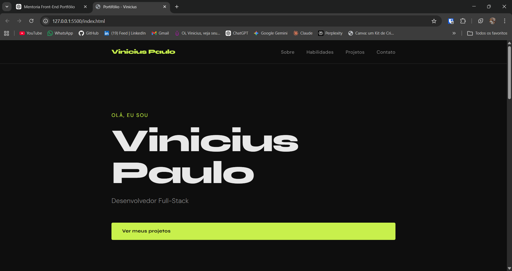

# 💼 Portfólio - Vinicius Paulo

## 📌 Sobre o projeto

Este é meu portfólio pessoal, onde apresento minhas habilidades, projetos e evolução como desenvolvedor.

O objetivo deste projeto é praticar conceitos fundamentais de desenvolvimento web, como estruturação semântica, estilização moderna e interatividade com JavaScript.

---

## 🚀 Tecnologias utilizadas

* HTML5
* CSS3 (Flexbox, Grid, Responsividade)
* JavaScript (DOM, eventos, animações)

---

## 🎨 Funcionalidades

* Layout moderno e responsivo
* Navegação com scroll suave
* Destaque da seção ativa no menu
* Animações ao rolar a página
* Header dinâmico ao scroll
* Estrutura semântica para melhor acessibilidade

---

## 📷 Preview



---

## 📂 Estrutura do projeto

```bash
meu-portifolio/
│── .gitignore
│── image.png 
│── index.html
│── README.md
│── style.css
│── script.js 
```

---

## 🧠 Aprendizados

Durante o desenvolvimento deste projeto, aprendi:

* Estruturação semântica com HTML
* Uso de Flexbox e Grid para layout
* Criação de animações com CSS e JavaScript
* Manipulação do DOM
* Uso de IntersectionObserver
* Boas práticas com Git e versionamento

---

## 📬 Contato

Caso queira entrar em contato comigo:

* Email: [viniciuspaulo0703@gmail.com](mailto:viniciuspaulo0703@gmail.com)

---

## 📄 Licença

Este projeto é de uso pessoal e para fins de estudo.

---

⭐ Se você gostou do projeto ou tenha alguma sugestão, não esqueça de deixar uma estrela e mandar uma mensagem no GitHub!
